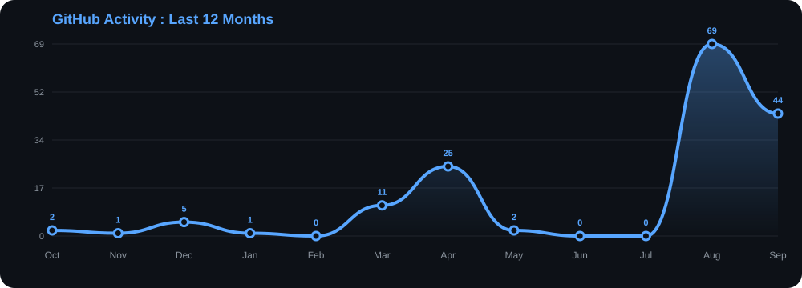

<!-- ===================== HEADER ===================== -->

<div align="center">


# 👋 Hey, I'm Ayoub Gouiaa

### Full-Stack Developer • Test Automation Engineer • AI Explorer


<br/>

<a href="https://www.linkedin.com/in/ayoub-gouiaa">
  
</a>
<a href="mailto:ayoubgouiaa.etudiant@gmail.com">
  
</a>

</div>

---

## 🙌 About Me

I'm a **Computer Science student at ISITCom**, ranked **#1 across the institute**, with a strong interest in building software, solving problems, and continuously exploring new technologies.

I'm a **hybrid combination** of a technically driven developer and a highly social, adaptable person. I enjoy writing code and designing systems, but I also enjoy working with people, organizing events, creating content, and turning ideas into something real.

My main interests currently revolve around:

- 💻 Full-Stack Development
- 🧪 Test Automation & Software Quality
- 🤖 AI-powered applications
- 🏗️ Backend & API development
- 🎨 Design & Creative Technology
- 🤝 Teamwork, communication & community building

---

## ⚡ What I Do

<table>
<tr>
<td width="50%">

### 💻 Software Engineering

I build web applications and backend systems using modern JavaScript/TypeScript ecosystems.

**Focus:**
- Full-Stack Development
- REST APIs
- Authentication
- Databases
- Reusable architectures
- Clean & maintainable code

</td>

<td width="50%">

### 🧪 Test Automation

I also work on modern end-to-end automation and software quality.

**Focus:**
- Playwright
- Cucumber.js
- Gherkin
- Page Object Model
- Reusable automation components
- Test reporting

</td>
</tr>

<tr>
<td width="50%">

### 🤖 AI & Modern Development

I enjoy experimenting with AI and integrating intelligent features into applications.

**Focus:**
- AI API integration
- Gemini
- AI-powered recommendations
- Data processing
- AI-enhanced applications

</td>

<td width="50%">

### 🎨 Creative & Community

Technology isn't the only thing I work with.

I also have experience in:

- Community Management
- Event Organization
- Graphic Design
- Video Editing
- Communication
- Team Coordination

</td>
</tr>
</table>

---

# 🛠️ Tech Stack

### Languages

<p>

</p>

### Frontend

<p>

</p>

### Backend & Databases

<p>

</p>


###  Testing & Automation

<p align="left">
  
  
</p>


### Tools & Platforms

<p>

</p>

---

# 🚀 Featured Projects

### 🧭 Bideyeti

**AI-Powered University Orientation Platform**

A smart platform helping Tunisian bacheliers explore universities, specialties, admission scores, and career opportunities based on their profiles and interests.

**Stack:** React • TypeScript • Node.js • Prisma • Gemini API

> Built as part of a team, contributing to backend APIs, structured university datasets, AI recommendations and system design.

---

### 🏃 TuniFit

**Full-Stack Health Tracking Platform**

A web application for tracking calories, sleep, hydration and Tunisian food, with an administration dashboard for analytics and database management.

**Stack:** React • Node.js • Express.js • MongoDB

---

### 🧪 Test Automation Framework

**End-to-End Software Testing & Automation**

Modernized and stabilized an automated testing framework using Playwright, Cucumber.js and Gherkin.

- ♻️ Reusable Page Objects
- 🧩 Generic step definitions
- 🏗️ Shared automation components
- ✅ 500+ test cases validated
- 📊 Automated Excel test reporting

---

## 📈 GitHub Activity

<div align="center">



</div>

---

# 🌱 Currently Exploring

```text
Full-Stack Development
        ↓
Backend Architecture
        ↓
Test Automation
        ↓
AI-powered Applications
        ↓
Building better software
